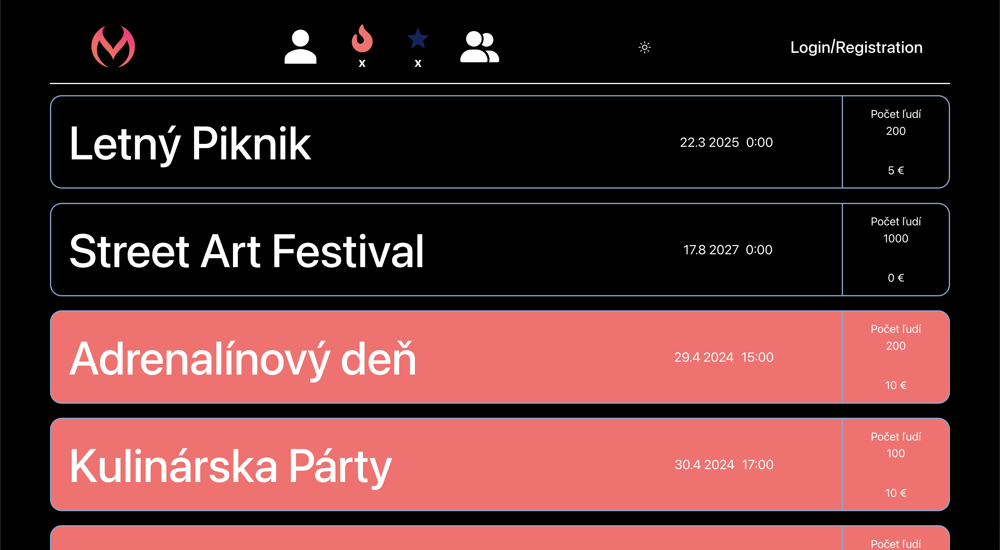
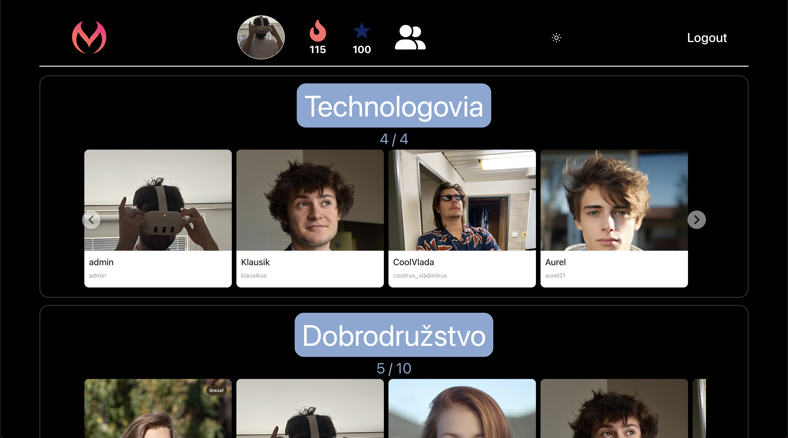
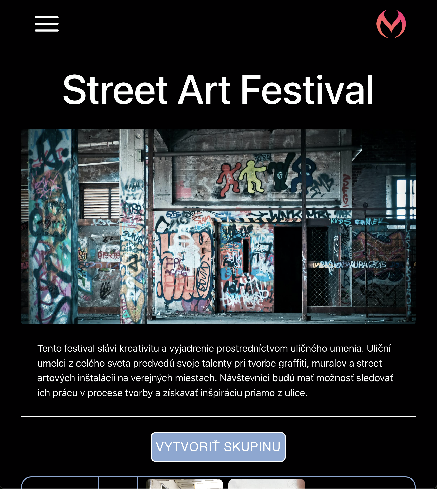

# Meet Us

## O aplikácii
+ Prisťahovali ste sa do mesta a chcete spoznať niekoho so spoločnými záujmami?
+ Chystáte sa na party do klubu, ale nemáte nikoho s kým by ste išli?
+ Chcete sa prihlásiť na amatérsky turnaj vo volejbale, ale nemáte hráčov do tímu?
+ Plánujete sa zúčastniť letného festivalu v zahraničí, ale nechcete ísť sám?

Potom je tu riešenie - `Meet Us`, aplikácia ktorá spája ľudí
<br>

## Používanie aplikácie
### 3 pohlady - public, user, admin
+ `public`  -> nemôže využívať funkcionality aplikácie (iba login/registration)
+ `user`    -> vytvoriť skupinu, pridať sa do skupiny, zobraziť všetky skupiny, v ktorých sa nachádza, logout
+ `admin`   -> všetko čo môže user + vytvoriť event

### Registrácia
Vytvorenie účtu pre `public`

### Login
Prihlásenie sa s validnými prihlasovacími údajmi

### Darkmode
Možnosť farebne si prispôsobiť aplikáciu

### Ohník
Číslo pod ikonkou  nám hovorí v koľkých skupinách je/bol daný `user`

### Číslo pod ikonkou 'hviezda' nám hovorí aký rating má user
+ `rating` - čím väčší rating tým je user sympatickejší
+ funkcionalita rating zatiaľ nebola v aplikácii implementovaná
+ na konci eventu môže user ohodnotiť členov skupiny, s ktorými
+ bol na aplikácii 
	+ `rating` -> inkrement hodnoty
	+ `rating` -> dekrement hodnoty
    
## Aplikácia z technickej stránky
Pri zmene `server gateway` je nutné prenastaviť túto hodnotu aj v `/client/src/Technician/InfoAboutServer.js`
    
Ide o môj prvý väčší projekt, po jeho dokončení som si uvedomil, že kód sa dal napísať lepšie

Čo ma projekt naučil alebo čo by som zmenil na tomto projekte keby som ho vytváral od začiatku:

### Frontend
+ kód by som rozdelil zmysluplnejšie do komponent
+ každý modal by bol samostatná komponenta
+ použiť zmysluplnejšie názvy súborov (`Technician`, `UserCardF` - F ako folder, `NavbarF`, ...)
+ nájsť lepší spôsob akým implementovať `Darkmode` (kód v niektorých častiach vyzeral divoko - `client/src/forApplication/CreateNewGroup/AddGroup.js`)
### Backend
+ na strane servera by som spravil storage ako samostatnú zložku (`/storage`) a nie ako podzložku Dao (`Dao/storage`)
+ jedným z cieloch projektu bolo naučiť sa pracovať so súbormi (`/storage`), v budúcnosti radšej implementovať databázu
+ zabezpečiť hashovanie hesla, aby pri registrácii nešlo otvorené heslo od clienta serveru

## Záver
+ Podarilo sa mi vytvoriť funkčú aplikáciu kde komunikuje client (`React JS`) a server (`Express JS`)
+ Projekt mi dal mnoho skúseností a ukázal mi, že stále sa je čo učiť a existuje stále kopa veci v čom sa zdokonaľovať
+ Projekt mi poskytol základnú kostru vytvárania aplikácii, v budúcnosti budem vedieť čo a ako spraviť lepšie, čomu sa vyhnúť a čo spraviť inak
+ Aj keď projekt nie je 100% perfektný slúži pre mňa ako odrazový mostík do sveta webdevu...

## Spustenie aplikácie
Spustenie `serveru` (uistite sa, že ste v zložke ./server)
```
npm run devStart
```
Spustenie `clienta` (uistite sa, že ste v zložke ./client)
```
npm start
```
Užite si aplikáciu 🙂
<br>

Prikladám iba pár obrázkov, pre najlepšiu vizualizáciu aplikáciu odporúčam aby ste si ju prešli sami
<br>
